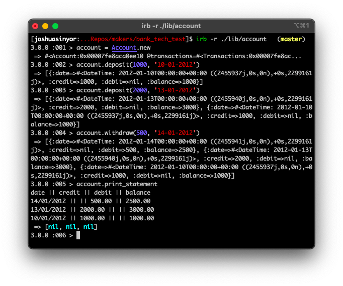

# Bank Tech Test

This repository reflects Makers Academy Week 10 project [Bank Tech Test](https://github.com/makersacademy/course/blob/master/individual_challenges/bank_tech_test.md). The general overview of this challenge is to create a bank account manager.

---

## Table of Contents

- [Specification](#specification)
  * [Requirements](#requirements)
  * [Acceptance Criteria](#acceptance-criteria)
- [Getting Started](#getting-started)
  * [Prerequisite(s)](#prerequisite-s-)
  * [Installation](#installation)
- [Running the Program](#running-the-program)
  * [Making a Deposit](#making-a-deposit)
  * [Making a Withdrawal](#making-a-withdrawal)
  * [Printing a Statement](#printing-a-statement)
- [Development Process](#development-process)
  * [Modelling](#modelling)
    + [User Stories](#user-stories)
      - [User Story 01](#user-story-01)
      - [User Story 02](#user-story-02)
      - [User Story 03](#user-story-03)
      - [User Story 04](#user-story-04)
      - [User Story 05](#user-story-05)
    + [Domain Modelling](#domain-modelling)
  * [Test-Driven Design](#test-driven-design)
  * [Behaviour-Driven Design](#behaviour-driven-design)
  * [Continuous Development](#continuous-development)
  * [Refactoring](#refactoring)
- [Project Conclusions](#project-conclusions)
  * [Final Appearance](#final-appearance)
  * [Specific Characteristics of Note](#specific-characteristics-of-note)
  * [Additional Development](#additional-development)
- [Built With](#built-with)
- [Author(s)](#author-s-)
- [License(s)](#license-s-)
- [Acknowledgements](#acknowledgements)

---

## Specification

The specification of this tech test is as follows:

### Requirements

1. [x] You should be able to interact with your code via a REPL like IRB or the JavaScript console. (You don't need to implement a command line interface that takes input from STDIN.)
2. [x] Deposits, withdrawal.
3. [x] Account statement (date, amount, balance) printing.
4. [x] Data can be kept in memory (it doesn't need to be stored to a database or anything).

### Acceptance Criteria

> Given a client makes a deposit of 1000 on 10-01-2012, and\
> A deposit of 2000 on 13-01-2012, and\
> A withdrawal of 500 on 14-01-2012;\
> When she prints her bank statement,\
> Then she would see:

```
date || credit || debit || balance
14/01/2012 || || 500.00 || 2500.00
13/01/2012 || 2000.00 || || 3000.00
10/01/2012 || 1000.00 || || 1000.00
```

---

## Getting Started

### Prerequisite(s)

This project requires Ruby 3.0.0. If you do not have Ruby 3.0.0, install it using [these instructions](https://www.ruby-lang.org/en/documentation/installation/).

### Installation

1. [Clone](https://docs.github.com/en/github/creating-cloning-and-archiving-repositories/cloning-a-repository) or [fork](https://docs.github.com/en/github/getting-started-with-github/fork-a-repo) this repository.
2. Install the necessary Gems from the `Gemfile` by executing `bundle install`.

---

## Running the Program

1. Move your working directory to the project directory (`/bank_tech_test`).
2. Start the program by opening `account.rb` in your REPL of choice.
3. Create a new account by executing `account = Account.new`.

### Making a Deposit

Deposit funds to the account by executing `account.deposit(sum, "date")`, where the `sum` parameter is a non-optional positive integer, and the `date` parameter is a non-optional argument. To supply a `date` argument, use integers for day, month and year in the format `dd-mm-yyyy`.

### Making a Withdrawal

Withdraw funds from the account by executing `account.withdraw(sum, "date")`, where the `sum` parameter is a non-optional positive integer, and the `date` parameter is a non-optional argument. To supply a `date` argument, use integers for day, month and year in the format `dd-mm-yyyy`.

### Printing a Statement

Print an account statement to console by executing `account.print_statement`. Account statements are prefixed with a header, and transactions are printed in reverse order of input.

---

## Development Process

### Modelling

My approach to this problem relied on TDD, BDD, encapsulation and the SRP in order to create modular code that could be tested in independent units as well as collectively in features. The problem itself is simple; with no GUI it was not necessary to structure an MVC/MVP model. I split responsibilities into several classes so as to improve readability and modularity. I tried to balance the SRP against oversimplification leading to an excessive number of component classes.

To keep the code readable, I prioritised thoughtful naming of objects to reduce the need to explain in comments the purpose of each object and method.

#### User Stories

The requirements can be parsed in several simple user stories.

Actions are *italic*. Nouns are **bold**. Attributes of nouns are **_bold italics_**.

##### User Story 01

&nbsp;&nbsp;&nbsp;As a user,<br>
&nbsp;&nbsp;&nbsp;So that I can add money to my account,<br>
&nbsp;&nbsp;&nbsp;I’d like to be able to *deposit* a **sum** in my **account**.

##### User Story 02

&nbsp;&nbsp;&nbsp;As a user,<br>
&nbsp;&nbsp;&nbsp;So that I can remove money from my account,<br>
&nbsp;&nbsp;&nbsp;I’d like to be able to *withdraw* a **sum** from my **account**.

##### User Story 03

&nbsp;&nbsp;&nbsp;As a user,<br>
&nbsp;&nbsp;&nbsp;So that I know when I added or removed money from my account,<br>
&nbsp;&nbsp;&nbsp;I’d like to be able to *add a date* to each **transaction**.

##### User Story 04

&nbsp;&nbsp;&nbsp;As a user,<br>
&nbsp;&nbsp;&nbsp;So that I know how much money is in my account,<br>
&nbsp;&nbsp;&nbsp;I’d like to be able to *print* my **account**'s **_balance_**.

##### User Story 05

&nbsp;&nbsp;&nbsp;As a user,<br>
&nbsp;&nbsp;&nbsp;So that I can see my account's transactions,<br>
&nbsp;&nbsp;&nbsp;I’d like to be able to *print in reverse chronological order* my **account**'s **_transactions_**.

#### Domain Modelling

As per [Class Responsibility Collaborator](http://agilemodeling.com/artifacts/crcModel.htm) modelling, there are three obvious areas of responsibility, and therefore three classes - **Account**, **Transaction** and **Printer**.

Class: **Account**

Responsibility | Collaborators
--- | ---
Knows own transactions | Transactions

Class: **Transactions**

Responsibility | Collaborators
--- | ---
Knows own transaction dates |
Knows own transaction sums |
Knows own balance |

Class: **Printer**

Responsibility | Collaborators
--- | ---
Knows transactions | Account

The relationship between these classes can be summarised in this Domain Model Diagram:


### Test-Driven Design

TDD was used to structure Unit Tests. These were employed to test individual classes and their methods to ensure that they interacted as expected. RSpec was instructed (using the `--format documentation` and `--color` arguments to provide verbose feedback on passing and failing tests.

### Behaviour-Driven Design

BDD was used to structure Feature Tests. After unit tests were created to test methods and classes in isolation, feature tests were employed to test the entire program.

### Continuous Development

The code was continuously tested throughout development to ensure development was proceeding as expected, and that changes during development did not impact previously tested units and features.

### Refactoring

Refactoring was performed after the completion of any individual unit, and periodically throughout development, in order to simplify the code. The aim was to keep the code simple and readable, rather than as compact as possible. To check that the resulting code conformed to the Ruby style guide, it was parsed before each commit through Rubocop (integrating Rubocop-rspec), a linter.

---

## Project Conclusions

### Final Appearance

As per the instructions, this program runs exclusively in a REPL. It is pictured below executing the instructions in the Acceptance Criteria.



### Specific Characteristics of Note

The presented development state shows some aspects of note:

1. The date of transactions is stored as a `DateTime` object, rather than as a string. It seems best practice to store dates in an appropriate object, especially because this compartmentalisation allows easy reformatting (using `strftime`) and greater precision (e.g. hours and minutes) should that be desirable in the future.
2. Transactions are stored as hashes, rather than strings. This makes it easier to reference the characteristics (`:date`, and `:sum`) of each transaction.
3. A true deep copy (using `Marshal.load(Marshal.dump(array))`) is used to create a clone of the `@transactions` array. This is required because the array's elements individual transactions have `DateTime` objects. Ruby's `dup`, `deep_dup` and `clone` methods are all shallow copies.
4. The presence of a full-blown feature test, using Ruby's poorly documented `PTY` package. The feature test (integrated in RSpec) opens the program from scratch in a pseudoterminal and executes the acceptance criteria tests specified.
5. 100% test coverage (according to SimpleCov) was achieved.
6. Rubocop reports only 2 errors, a DescribeClass and an unavoidable ExampleLength, both relating to the feature test. The latter could be easily corrected, but would make the RSpec output less clear.

### Additional Development

I suggest implementing some additional features:

1. Suppressing the output of the terminal to reduce clutter.
2. Making the `date` argument optional by setting a default parameter (`DateTime.now`).
3. Sorting the transaction array elements into reversed chronological order - compensating for input of transactions out of chronological order - before printing. This would require a shift to dynamic calculation of the `balance` value.
4. Rejection of withdrawals when funds would be insufficient to cover them (returning error `Insufficient funds available!`).
5. Code hardening to improve resilience against erroneous input, and provide more helpful error messages.
6. Justification of tables to align columns to the widest content.

---

## Built With

This program's dependencies are minimal and relate solely to testing. They were chosen for their ubiquity and self-contained nature, so that they could be specified as `require: false` and required only in the `test` environment to reduce their impact on the program's speed. For clarity, all dependencies are explicitly invoked by the `Gemfile`.

- [Ruby](https://www.ruby-lang.org/), courtesy of [Yukihiro Matsumoto](https://github.com/matz).
- [RSpec](https://rspec.info/), courtesy of [Jon Rowe](https://github.com/JonRowe), [Benoit Tigeot](https://github.com/benoittgt), [Phil Pirozhkov](https://github.com/pirj), [Xavier Shay](https://github.com/xaviershay) and [Yuji Nakayama](https://github.com/yujinakayama).
- [Rubocop](https://rubocop.org/) and [Rubocop-RSpec](https://github.com/rubocop/rubocop-rspec), both courtesy of [Bozhidar Batsov](https://github.com/bbatsov).
- [SimpleCov](https://github.com/simplecov-ruby/simplecov), courtesy of [Christoph Olszowka](https://github.com/colszowka).
- [SimpleCov-Console](https://github.com/chetan/simplecov-console), courtesy of [Chetan Sarva](https://github.com/chetan).
- [SimpleCov-Shields-Badge](https://github.com/niltonvasques/simplecov-shields-badge), courtesy of [Nilton Vasques](https://github.com/niltonvasques).

---

## Author(s)

Authored by [Joshua Sinyor](https://gist.github.com/JoshSinyor).

---

## License(s)

This project is licensed under the [MIT License](LICENSE).

---

## Acknowledgements

- Diagram(s) generated with [Diagram.codes Studio](https://studio.diagram.codes/).
- Table of contents generated with [markdown-toc](http://ecotrust-canada.github.io/markdown-toc/).
