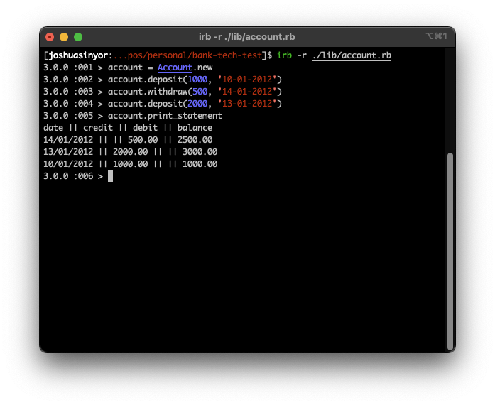

# Bank Tech Test

This repository reflects Makers Academy Week 10 project [Bank Tech Test](https://github.com/makersacademy/course/blob/master/individual_challenges/bank_tech_test.md). The general overview of this challenge is to create a bank account manager.

This branch represents, for consideration, implementation of suggested improvements. Only these improvements are described in this README; this repository is built on the `main` branch, and incorporates the elements described in that branch's README.

---

## Table of Contents

- [Features of Note](#features-of-note)
- [Specification](#specification)
  * [Requirements](#requirements)
  * [Acceptance Criteria](#acceptance-criteria)
- [Running the Program](#running-the-program)
  * [Creating an Account](#creating-an-account)
  * [Making a Deposit](#making-a-deposit)
  * [Making a Withdrawal](#making-a-withdrawal)
  * [Printing a Statement](#printing-a-statement)
- [Project Conclusions](#project-conclusions)
  * [Final Appearance](#final-appearance)

---

## Features of Note

1.  

---

## Specification

The specification of the improved tech test is as follows:

### Requirements

1. [x] All REPL output should be suppressed unless commanded by the execution of `account.print_statement`.
2. [x] All transactions should be sorted by date upon execution of the command `account.print_statement`.

### Acceptance Criteria

> Given a client makes a deposit of 1000 on 10-01-2012, and\
> A withdrawal of 500 on 14-01-2012, and\
> A deposit of 2000 on 13-01-2012;\
> When she prints her bank statement,\
> Then she would see:

```
date || credit || debit || balance
14/01/2012 || || 500.00 || 2500.00
13/01/2012 || 2000.00 || || 3000.00
10/01/2012 || 1000.00 || || 1000.00
```
---

## Running the Program

1. Move your working directory to the project directory (`/bank_tech_test`).
2. Start the program by opening `account.rb` in IRB.

### Making an Account

Create an account by executing `name = Account.new`, where the `name` parameter is a non-optional string. The following instructions presume your instance of the `Account` class is named `account`.

### Making a Deposit

Deposit funds to the account by executing `account.deposit(sum, "date")`, where the `sum` parameter is a non-optional positive integer, and the `date` parameter is a non-optional argument. To supply a `date` argument, use integers for day, month and year in the format `dd-mm-yyyy`.

### Making a Withdrawal

Withdraw funds from the account by executing `account.withdraw(sum, "date")`, where the `sum` parameter is a non-optional positive integer, and the `date` parameter is a non-optional argument. To supply a `date` argument, use integers for day, month and year in the format `dd-mm-yyyy`.

### Printing a Statement

Print an account statement to console by executing `account.print_statement`. Account statements are prefixed with a header, and transactions are printed in reverse order of input.

---

## Project Conclusions

### Final Appearance

As per the instructions, this program runs exclusively in a REPL. It is pictured below executing the instructions in the updated form of the original Acceptance Criteria.


